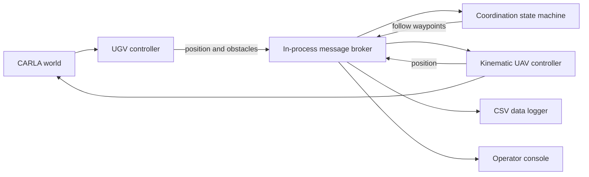

# UAV–UGV Coordination in CARLA

A collaborative Florida Atlantic University senior-design project exploring how an aerial follower can track a ground vehicle inside CARLA. Modular controllers exchange position and waypoint messages, while a coordination state machine handles tracking, stale telemetry, search, and mission completion.

## Implemented capabilities

- Ground vehicle navigation through CARLA autopilot or scripted routes using `BasicAgent` when CARLA's agent modules are available.
- A kinematic aerial follower with speed, acceleration, vertical-motion, and yaw-rate limits, plus an attached RGB camera.
- Follow waypoints calculated from ground-vehicle heading, distance, altitude, lateral offset, and velocity lookahead.
- Target-loss detection based on stale ground-vehicle position messages, with hover and spiral search behavior.
- LiDAR processing and obstacle telemetry, an operator GUI, and timestamped CSV logging of positions, obstacles, and state changes.

## Architecture



The aerial vehicle is a CARLA actor or sensor platform moved by a kinematic model, since CARLA does not provide native UAV flight dynamics. Tracking uses vehicle telemetry; the RGB feed does not establish computer-vision target tracking.

## Run on the documented Windows setup

Prerequisites: Windows 10/11, Python 3.12, a CARLA 0.9.16 server, and its matching Python API. Availability of the CARLA package depends on platform and Python version.

```powershell
git clone https://github.com/OmElMon/G27-Project.git
cd G27-Project
py -3.12 -m venv .venv
.venv\Scripts\Activate.ps1
pip install -r requirements.txt
```

If the pinned CARLA package cannot be installed, use the compatible API distribution from your CARLA installation. For scripted routes, make `CARLA/PythonAPI/carla` available on `PYTHONPATH` so `agents.navigation` imports successfully. The code also checks a project-local `Carla/PythonAPI/carla` directory.

Launch the CARLA server separately, wait for its map to load, then run:

```powershell
python main_gui.py
# Or use the terminal runner:
python main.py
```

The runners prompt for navigation mode, follow distance, altitude, and camera target. Stop with the GUI Quit button or `Ctrl+C`. Logging uses a timestamped directory under the configured log directory, defaulting to `logs/`.

## Source guide

| File | Role |
| --- | --- |
| `main.py`, `main_gui.py` | Simulation orchestration and lifecycle |
| `ugv_controller.py` | Ground navigation and telemetry |
| `uav_controller.py` | Aerial follower and kinematic movement |
| `coordination_platform.py` | Follow geometry and state transitions |
| `message_broker.py` | Publish/subscribe communication |
| `gui_console.py` | Operator interface |
| `data_logger.py` | CSV recording and separation metrics |
| `config.py` | Runtime parameters and topics |
| `ed2_avoid.py`, `sensor_manager.py` | Additional obstacle/sensor code |
| `reference/` | Earlier reference implementation |

## Validation and limits

Subsystem entry points include `python coordination_platform.py` for simulated-message coordination exercises and CARLA-dependent `python ugv_controller.py` / `python uav_controller.py`. These are manual exercises, not an automated assertion-based test suite. The repository has no GitHub Actions runs at the time of this audit. A CARLA simulation was not executed for this documentation update.

The terminal runner parses `--host` and `--port`, but its connection method currently uses configuration constants rather than those parsed values; configure the connection in `config.py` until that wiring is fixed. Reproducible scenario tests, quantitative following-error plots, and improved sensor fusion are useful next steps.

## Team and attribution

This is a team project; module ownership annotations in source should be preserved.

- Evan Frisone — Team Leader, Computer Science
- Omar Elharbili — Computer Science
- Sean Bowden — Computer Science
- Roberson Robert — Team Member
- Syeda Haque — Computer Science

Sponsor / mentor: Dr. Xiangnan Zhong, Florida Atlantic University.

No license file is currently included; no open-source license is asserted here.
